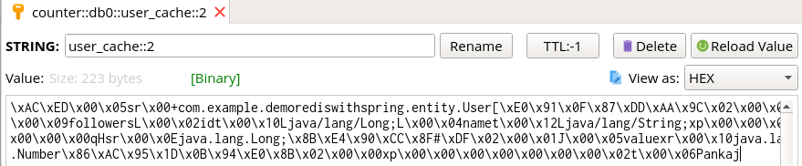

- [Redis](#redis)
  - [What is redis?](#what-is-redis)
  - [What is redis data types? How to use it?](#what-is-redis-data-types-how-to-use-it)
    - [List](#list)
    - [Sets](#sets)
    - [Hashes](#hashes)
    - [Sorted set](#sorted-set)
    - [HyperLogLogs](#hyperloglogs)
  - [How to use distributed lock with redis?](#how-to-use-distributed-lock-with-redis)
    - [vì sao cần thuật toán redlock](#v%c3%ac-sao-c%e1%ba%a7n-thu%e1%ba%adt-to%c3%a1n-redlock)
    - [Thuật toán redlock](#thu%e1%ba%adt-to%c3%a1n-redlock)
    - [How to use distributed lock redis java](#how-to-use-distributed-lock-redis-java)
  - [What is redis persistance? How many modes? Advantages & disadvantages of theses?](#what-is-redis-persistance-how-many-modes-advantages--disadvantages-of-theses)
    - [RDB persistence](#rdb-persistence)
    - [AOF persistence](#aof-persistence)
  - [How to configure redis?](#how-to-configure-redis)
  - [How to optimize memory?](#how-to-optimize-memory)
  - [What will happen when Redis reaches its memory limit?](#what-will-happen-when-redis-reaches-its-memory-limit)
  - [Sring boot starter data redis](#sring-boot-starter-data-redis)
    - [Dependency](#dependency)
    - [Jedis and Lettuces](#jedis-and-lettuces)
    - [Config](#config)
    - [Spring boot starter redis cache](#spring-boot-starter-redis-cache)
      - [@Cacheable](#cacheable)
      - [@CacheEvict](#cacheevict)
      - [@CachePut](#cacheput)
      - [Multi config cache @Caching](#multi-config-cache-caching)
    - [Operation on Entity](#operation-on-entity)
  - [redisson-spring-boot-starter](#redisson-spring-boot-starter)
    - [Dependency](#dependency-1)
    - [Setting](#setting)
    - [Redis cluster](#redis-cluster)
    - [Redis Sentinel](#redis-sentinel)
  - [Refference](#refference)
# Redis

## What is redis?

Redis được xem như là  data structures server bằng cách cung cấp nhiều lọai data structure thông qua các câu lệnh command. các câu lệnh command được gửi và nhận thông qua TCP socket với redis server, do đó với nhiều process khác nhau có thể cùng tương tác vào cùng một data structure.

Có một số  đặc điểm đặc biệt của redis như sau
- Redis quan tâm đến vấn đề lưu trữ dữ liệu trên đĩa, mặc dù bình thường chúng được sử dụng và update dữ liệu trên bộ nhớ, do đó Redis không những nhanh mà ta còn không cần lo lắng đến vấn đề mất dữ liệu khi tắt chương trình.
- data structure trên redis được tối ưu sử dụng ít bộ nhớ hơn các data structure được sử dụng trên các ngôn ngữ lập trình thông thường
- có một số feature đặc biệt như replication,  tunable levels of durability, cluster, high availability.

Redis được biết đến nhiều nhất vào việc được sử dụng như một memcache bằng cách thực hiện các thao tác GETS, SETS.

## What is redis data types? How to use it?

Redis có 5 cấu trúc dữ liệu chính là String, Hash, List, Sets, Sorted Set, HyperLoglog

### List

Redis list là danh sách các chuỗi được sắp xếp theo thứ tự truyền vào, có thể thêm vào đầu bằng LPUSH hoặc vào cuối bằng RPUSH. tương tự như vậy ta cũng có thể lấy các phần tử hoặc cập nhật các phần tử trong List.
Redis Lists là danh sách của các chuỗi, Sắp xếp theo thứ tự chèn vào. Bạn có thể thêm element tới một List Redis vào đầu hoặc vào cuối. Chiều dài tối đa của một list  là hơn 4 tỉ của các element/list, các thao các thêm hoặc xóa các element cuối hoặc đầu list với độ phức tạp hằng số. Các thao tác ở giữa list (với list nhiều phần tử) thì chi phí tương đương O(n)
Các câu lệnh đã sử dụng:


```sh
127.0.0.1:6379> LPUSH fresher chithuc
(integer) 1
127.0.0.1:6379> LPUSH fresher 21
(integer) 2
127.0.0.1:6379> LPUSH fresher VNG
(integer) 3
127.0.0.1:6379> LRANGE fresher 0 2
1) "VNG"
2) "21"
3) "chithuc"
```

### Sets

Redis Sets là một tập có thứ tự của các chuỗi, bạn có thể thêm, xóa, kiểm tra sự tồn tại của chuỗi trong sets với độ phức tạp O(1). CÁc giá trị trong set không có trùng lặp. Số lượng lớn nhất của member trong set là 2^32 – 1 (hơn 4 tỉ member/set). Dùng lệnh sadd để thêm giá trị vào Sets, và smembers để kiểm tra tất cả các giá trị có trong Sets đó.
Câu lệnh đã sử dụng:

SADD: key value1: thêm các giá trị value vào tập hợp

SMEMBERS: lấy các phần tử trong tập hợp.

```sh
127.0.0.1:6379> SADD fresher thuc
(integer) 1
127.0.0.1:6379> SADD fresher 21 vng
(integer) 2
127.0.0.1:6379> SMEMBERS fresher
1) "21"
2) "thuc"
3) "vng"
```

### Hashes

Redis hash là lệnh sử dụng để quản lý các key/value trong đó value có giá trị là hash.  vì thế chúng là kiểu dữ liệu hoàn hảo tới các object.Trong redis mổi hash có thể lưu trử tới hơn 4 tỷ cặp field-value.
Câu lệnh sử dụng:


HMSET key field value: đặt giá trị cho field là value trong hash

```sh
HGET key field: lấy giá trị field trong hash.
127.0.0.1:6379> HMSET user:1 ten "thuc" tuoi "21"
OK
127.0.0.1:6379> HGET user:1 ten
"thuc"
127.0.0.1:6379> HGET user:1 tuoi
"21"
```

### Sorted set

Kiểu dữ liệu tương tự như Redis Sets, không lặp lại giá trị. Điểm khác biệt ở đây là Sorted Set mỗi giá trị liên kết với một số được xem là độ ưu tiên của số đó  (có thể lặp lai), điểm số này là cơ sở cho viêc tạo ra Sorted Sets có thứ tự. Với sorted set ta có thể thêm, xóa, kiểm tra tồn tại các phần tử trong set với tốc độ rất nhanh, kể cả phần tử giữa set.
Các câu lệnh cơ bản:


ZADD key scroce1 value1 score2 value2: thêm các phần tử vào sorted set với độ uư tiên theo scroce

```sh
ZRANGE:  lấy các phần tử trong tập hợp từ start đến stop theo giá trị score của chúng.
127.0.0.1:6379> ZADD fresher 1 value1
(integer) 1
127.0.0.1:6379> ZADD fresher 2 value2
(integer) 1
127.0.0.1:6379> ZADD fresher 5 value5
(integer) 1
127.0.0.1:6379> ZADD fresher 3 value3
(integer) 1
127.0.0.1:6379> ZRANGE fresher 0 3 WITHSCORES
1) "value1"
2) "1"
3) "value2"
4) "2"
5) "value3"
6) "3"
7) "value5"
8) "5"
```

### HyperLogLogs

Là cấu trúc dữ liệu để đếm các phần tử phân biệt trong tập dữ liệu lớn, với hyperloglog kể cả cho số lượng phầ tử ngày càng lớn đi nữa thì ta vẫn không cần tăng lượng bộ nhớ sử dụng, đánh đổi lại thì tỉ lệ chính xác của hyperloglog chỉ đạt 99%.

Dưới đây là các câu lệnh được sử dụng với hyperloglog
- pfadd: thêm phần tử mới vào hyperloglog
- pfcount: đếm các phần tử phân biệt có trong tập hyperloglog

```sh
> pfadd hll a b c d
(integer) 1
> pfcount hll
(integer) 4
```
## How to use distributed lock with redis?

### vì sao cần thuật toán redlock

Trong trường hợp thông thường, redis tạo một key để giữ lock đó với limit time live, và khi release thì redis sẽ xóa key đó.

Vấn đề như sau: có một node bị fail dẫn đến master down -> sẽ tìm kiếm slave thay thế lên làm master. Nhưng sẽ có vấn đề sau vì  Redis replication is asynchronous.
- Client A yêu cầu lock trên master
- master lúc này bị crash và chuyển slave lên làm master nhưng chưa kịp chuyển thông tin là client A đã xin được lock
- Client B yêu cầu lock trên cùng resource với client A, nhưng lúc này master mới đã mất thông tin, nên vẫn cung cấp lock cho B -> lỗi.

### Thuật toán redlock

Để tránh lỗi trên thì redis sử dụng một instance cho các node, và tránh trường hợp client này remove lock được yêu cầu bởi client khác, để làm điều đó thì
- giả sử có N node, ta bắt đầu đếm thời gian hiện tại, đến từng node để xin key, với thời gian giới hạn ở từng node
- nếu xin được số key là trên (n+1)/2 cùng với thời gian đi xin nhỏ hơn thời gian expire thì xin key thành công, còn không là thất bại. Thời gian để tương tác với resource = thời gian expire - thời gian xin lock.
- Nếu thất bại thì sau một khoảng thời gian mới xin lại.

### How to use distributed lock redis java

https://dzone.com/articles/distributed-java-locks-with-redis

## What is redis persistance? How many modes? Advantages & disadvantages of theses?

Các thao tác trên redis chủ yếu là trên bộ nhớ, do đó cần phải có những biện pháp để tránh mất dữ liệu khi tắt chương trình, server bị tắt.

### RDB persistence

sau mỗi khoảng thời gian thì nó sẽ snapshot lại dataset của mình lại

Lợi ịch
- là một file nhỏ gọn tại mỗi thời điểm là nó lưu lại, dễ dàng tải hoặc truyền đến các máy chủ khác nhau.
- quá trình khởi động, load lại từ file RDB nhanh hơn AOF rất nhiều 

Nhược điểm
- không tốt trong trường hợp muốn hạn chế mất ít nhất dữ liệu nếu có thể , khi redis server bị donw thì ta có thể mất dữ liệu ở những thao tác cuối
- cần sử dụng các tiến trình con để lưu xuống đĩa, mất nhiều thời gian nếu tập dữ liệu lớn và CPU không đủ tốt

### AOF persistence

Ghi log lại tất cả các operation đã thực hiện trên dataset, và khởi động chạy lại khi server restart. và khi log quá lớn thì redis sẽ rewrite log.

Ưu điểm
- Ít mất dữ liệu hơn, đảm bảo các thao tác trên DB được lưu lại
- redis sẽ tự động rewrite AOF dưới background nếu nó đã quá nhiều, nó hoàn toàn an toàn, trong khi redis tiếp tục thêm vào các operation trong file cũ thì file mới được tạo với tập các operation cần thiết để tạo ra dataset tối thiểu, và một khi file mới đã sẵn sàng thì nó sẽ chuyển sang sử dụng tiếp tục file mới
- chứa tất cả các operation nên dễ hiểu và format

Nhược điểm
- AOF có độ lớn, lớn hơn RDB rất nhiều
- tốc độ load dữ liệu lên của AOF chậm hơn RDB rất nhiều

## How to configure redis?

Để config redis cache với độ lớn của cache và policy thay thế cache 

```sh
maxmemory 2mb
maxmemory-policy allkeys-lru
```

để set key expire ta dùng lệnh EXPIRE

```sh
redis> SET mykey "Hello"
"OK"
redis> EXPIRE mykey 10
(integer) 1
```

Với các redis-server đang chạy, ta cũng có thể reconfig bằng cách sử dụng câu lệnh `CONFIG SET `, hiệu lực câu lệnh sẽ được thực thi ngay lập tức và áp dụng cho các câu lệnh tiếp theo.

Ví dụ như sau `CONFIG SET SAVE "900 1 300 10"` với câu lệnh trên thì sẽ thay đổi policy persistence từ lưu sau 900 giây sau khi có một câu lệnh thành lưu sau 300 giây sau khi có 10 câu lệnh được thực thi. Hầu hết các cấu hình cần thiết trong file redis.conf đều được hỗ trợ bởi CONFIG SET. Để lấy ra thông tin hiện tại ta có thể sử dụng câu lệnh `CONFIG GET`

## How to optimize memory?

`Using 32 bit instances`: sử dụng key 32 bit để tiết kiệm nhiều bộ nhớ hơn cho mỗi key vì giá trị con trỏ để lưu trữ tốn ít bộ nhớ hơn.

`Special encoding of small aggregate data types`: cấu hình maximum number of elements and maximum element, để khi các phần tử nằm trong khoảng cấu hình này thì bộ nhớ sẽ được optimize nhiều hơn (10 lần so với 5 lần lúc bình thường). ví dụ cấu hình trong file redis.conf
```sh
hash-max-zipmap-entries 512 (hash-max-ziplist-entries for Redis >= 2.6)
hash-max-zipmap-value 64  (hash-max-ziplist-value for Redis >= 2.6)
list-max-ziplist-entries 512
list-max-ziplist-value 64
zset-max-ziplist-entries 128
zset-max-ziplist-value 64
set-max-intset-entries 512
```

`Bit and byte level operations`: 

`Use hashes when possible`: sử dụng hash nhiều nhất nếu có thể vì hash tốn rất ít bộ nhớ, và mới mỗi key có thể lưu được nhiều field và value trên key đó.

`Using hashes to abstract a very memory efficient plain key-value store on top of Redis`: Thay vì sử dụng nhiều key cho nhiều cặp giá trị thì ta có thể sử dụng một key cho nhiều cặp khóa giá trị. Với điều này thì cache locality sẽ tốt hơn rất nhiều nhưng cùng thời gian thao tác khi số cặp khóa giá trị không lớn, nó còn có thể đại diện cho các object hoặc model trên các ứng dụng.

`Memory allocation`: redis cho phép cấu hình max memory để cache (nhưng cũng có giới hạn nhỏ nhất). có một số điều cơ bản về Redis manage memory
- redis không phải luôn luôn free memory khi key bị removed. do đó cần để ý đến việc là khi ta cần sử dụng bộ nhớ như nào cho hợp lí. ví dụ trong chương trình ta có lần sử dụng 10GB nhưng hầu hết chương trình của mình chỉ sử dụng 5GB nhưng phía dưới ta vẫn phải cung cấp 10GB bộ nhớ để sử dụng.
- Nhưng với những bộ nhớ bạn đã free trước đó, khi thêm các key vào, nó sẽ tái sử dụng bộ nhớ đã được free chứ không cấp phát thêm nữa
- Do đó the fragmentation ratio  có vẻ phản ánh đúng sự thật trong bộ nhớ như thế nào. có TH là RSS ( physical memory actually used) / mem_used(current) quá cao nhưng mem_used lại quá thấp. 

Vì vậy ta cần phải cấu hình maxmemory để không là redis sẽ cảm thấy khi cần thiết nó sẽ cấp phát bộ nhớ nhiều nhưng lại không thể free được (với trường hơp này ít xảy ra thì sẽ dẫn đến bộ nhớ sẽ bị chiếm hết).

`Use integer IDs`: sử dụng id là integer thay vì các kiểu dữ liệu khác sẽ dẫn đến tiết kiệm bộ nhớ rất nhiều

Với bộ dữ liệu lớn(hơn 50000 dòng) thay vì sử  dụng hash ta có thể sử dụng list. Ví dụ thông thường ta lưu như sau: `hmset user:123 id 123 firstname Sripathi lastname Krishnan location Mumbai twitter srithedabbler` thì nó sẽ lưu trữ các cặp giá trị theo dạng như sau `["firstname", "Sripathi", "lastname", "Krishnan", "location", "Mumbai", "twitter", "srithedabbler"]`.
Với nhiều user thì các tên cột sẽ bị duplicate mặc dù hash tốn ít bộ nhớ để lưu nhưng với bộ dữ liệu lớn thì như vậy sẽ không tốt.

Thay vào đó ta sử dụng list với á hiệu là các cột sẽ tương đương với trị trí theo thứ tự `"firstname" => 0, "lastname" => 1` ví dụ như `lpush user:123 Sripathi Krishnan Mumbai srithedabbler` sẽ giúp ta tiết kiệm nhiều chi phí.

## What will happen when Redis reaches its memory limit?

 when it reaches the limit - which in turn may result in errors in the application but will not render the whole machine dead because of memory starvation.
 
Có thể dẫn đến error trong application nhưng sẽ không làm chết hết các node chỉ vì thiếu bộ nhớ.

## Sring boot starter data redis

### Dependency

```xml
		<dependency>
			<groupId>org.springframework.boot</groupId>
			<artifactId>spring-boot-starter-data-redis</artifactId>
		</dependency>
```

nó chứa các dependency con như spring-data-redis, reids-driver là lecctuce và spring-boot-starter

### Jedis and Lettuces

Redis và Lettuce đều là driver để sử dụng redis trong gói  spring-boot-starter-data-redis   .
- Jedis: không đảm bảo thread-safe khi application muốn dùng một instance cho nhiều thread, để đảm bảo thì Jedis tiếp cận với hướng là connection pool, mỗi thead sử  dụng một instance của jedis, làm tăng chi phí kết nối với redis server.
- Còn đối với lettuce thì có thể sử dụng một instance cho môi trường multi thread, do đó chỉ cần một instance lettuce kết nối với redis server ta cũng có thể đảm bảo thread-safe, ta có thể cấu hình việc instance lecttuce có thể tương tác với bao nhiêu client một lúc tối đa. Do đó redis sử dụng lettuce làm default driver để kết nối với redis.

Mặc định trong spring-boot-starter-data-redis sử dụng lecctuce làm driver default, và để cấu hình lecctuce thì ta sử dụng các thuộc tính trong application.properties

```java
spring.redis.lettuce.pool.max-active=7 
spring.redis.lettuce.pool.max-idle=7
spring.redis.lettuce.pool.min-idle=2
spring.redis.lettuce.pool.max-wait=-1ms  
spring.redis.lettuce.shutdown-timeout=200ms
```

để có thể sử dụng jedis ta cấu hình trong dependency nnhuw sau
```xml
<dependency>
  <groupId>org.springframework.boot</groupId>
  <artifactId>spring-boot-starter-data-redis</artifactId>
  <exclusions>
    <exclusion>
	 <groupId>io.lettuce</groupId>
	 <artifactId>lettuce-core</artifactId>
    </exclusion>
  </exclusions>		    
</dependency>		
<dependency>
  <groupId>redis.clients</groupId>
  <artifactId>jedis</artifactId>
</dependency>
```

và cấu hình trên properties các thuộc tính của jedis
```java
spring.redis.jedis.pool.max-active=7 
spring.redis.jedis.pool.max-idle=7
spring.redis.jedis.pool.min-idle=2
spring.redis.jedis.pool.max-wait=-1ms 
```

### Config

Trong application-properties thì ta có thể cấu hình redis thông qua `spring.redis.*` để cấu hình port, server, max-connect, time-live,...

```sh
spring.redis.database=0 # Database index used by the connection factory.
spring.redis.host=localhost # Redis server host.
spring.redis.password= # Login password of the redis server.
spring.redis.pool.max-active=8 # Max number of connections that can be allocated by the pool at a given time. Use a negative value for no limit.
spring.redis.pool.max-idle=8 # Max number of "idle" connections in the pool. Use a negative value to indicate an unlimited number of idle connections.
spring.redis.pool.max-wait=-1 # Maximum amount of time (in milliseconds) a connection allocation should block before throwing an exception when the pool is exhausted. Use a negative value to block indefinitely.
spring.redis.pool.min-idle=0 # Target for the minimum number of idle connections to maintain in the pool. This setting only has an effect if it is positive.
spring.redis.port=6379 # Redis server port.
spring.redis.sentinel.master= # Name of Redis server.
spring.redis.sentinel.nodes= # Comma-separated list of host:port pairs.
spring.redis.timeout=0 # Connection timeout in milliseconds. 
```

### Spring boot starter redis cache

Ta sử dụng `@EnableCaching` trong file config hoặc application để có thể sử  dụng redis như bộ nhớ cache bằng cách sử dụng các annotation sau trên các api của controller

#### @Cacheable

```java
    @Cacheable(value = "users", key = "#userId")
    @RequestMapping(value = "/{userId}", method = RequestMethod.GET)
    public User getUser(@PathVariable String userId) {
        LOG.info("Getting user with ID {}.", userId);
        return userService.findUserById(Long.valueOf(userId));
  }
```

khi gọi đên api này, đầu tiên sẽ check xem trong redis đã lưu cache lại chưa, nếu chưa thì nó sẽ gọi method getUser, và sẽ caching lại kết quả đó dưới redis, ở đây là cả Object user. Dưới redis, lưu dưới dạng string, key là tên được quy định trong `value`, còn giá trị là mã byte đã được decode


#### @CacheEvict

có chức năng remove các entry trong redis thông qua cacheName hoặc value, thường được dùng cho các controller delete. @cacheEvict có thể đươc sử dụng để xóa một, nhiều hay toàn bộ entry.

```java
    @CacheEvict(value = "users", key = "#userId")
    @DeleteMapping("/{userId}")
    public void deleteUserByID(@PathVariable Long userId) {
        LOG.info("deleting person with id {}", userId);
        userService.deleteUserById(userId);
    }
```

Ở ví dụ trên, khi gọi api này, redis sẽ xóa dữ liệu trong database và xóa dữ liệu cache ở cả redis nếu đã được cache trước đó key là userId, hoặc có thể  xóa hết entry thông qua attribute khác như ` allEntries =true`.

#### @CachePut

dùng khi dữ liệu được thay đổi, thì cần cập nhật trong entry dưới redis để persist giữ cache và data, khi khai báo nó sẽ tự động cập nhật mà không cần thêm bất kì dòng code nào vào phương thức.

```java
    @CachePut( value = "users", key = "#user.id")
    @PutMapping("/update")
    public User updatePersonByID(@RequestBody User user) {
        userService.saveUser(user);
        return user;
    }
```

khi gọi phương thức update user, với key là userId thì khi thực hiện phương thức nó sẽ cập nhật trên cả redis.

#### Multi config cache @Caching

với việc cấu hình multi annotation cache trên các method ta sử dụng @caching, ví dụ cụ thể sau đây
```java

@Caching(evict = { 
  @CacheEvict("addresses"), 
  @CacheEvict(value="directory", key="#customer.name") })
public String getAddress(Customer customer) {...}
```

### Operation on Entity

Ngoài việc thực hiện các việc cache trên thông qua các method trên controller, ta có thể  thực hiện các operation của redis trên các entity thông qua RedisTemplate, hoặc có thể dựa vào operation trên datatype cụ thể như `StringRedisTemplate`, `HashOperations`,...

```java
    @Bean
    public RedisConnectionFactory redisConnectionFactory() {
        LettuceConnectionFactory connectionFactory = new LettuceConnectionFactory();
        return connectionFactory;
    }
    @Bean
    public RedisTemplate<String, User> redisTemplate() {
        RedisTemplate<String, User> redisTemplate = new RedisTemplate<>();
        redisTemplate.setConnectionFactory(redisConnectionFactory());
        return redisTemplate;
    }
```

Đầu tiên ta khởi tạo redisConnectionFactory, ở đây ta có thể config các cấu hình của mình thông qua constructor của lecttuce, ở đây ta có thê cấu hình port, cluster,...

với redis-template, tùy thuộc vào operation mà ta sử dụng trên java, thì nó sẽ mapping tương đuongư với kiểu dữ liệu trên redis, nhưng ở dưới redis chỉ luuư dưới dạng byte cho cả key và value.

## redisson-spring-boot-starter

### Dependency

Để sử dụng gói redission-spring-boot-starter, thì ta cần thêm dependency như sau
 
```xml
    <dependency>
         <groupId>org.redisson</groupId>
         <artifactId>redisson-spring-boot-starter</artifactId>
         <version>3.11.5</version>
     </dependency>
```
với dependency này, spring boot sẽ tự động cấu hình bean Redission client, nếu muốn sử dụng ta chỉ cần autowire bean đó vào

### Setting 

Có thể cấu hình redission trên file application.properties với các thông tin như host, port, password, ssl, timeout, cluster,...

```java
spring.redis.database=
spring.redis.host=
spring.redis.port=
spring.redis.password=
spring.redis.ssl=
spring.redis.timeout=
spring.redis.cluster.nodes=
spring.redis.sentinel.master=
spring.redis.sentinel.nodes=
```

Mặc định spring boot sẽ cấu hình mặc định là localhost và port là 6379.

### Redis cluster

là một data sharding cho việc automatic management, handling failover and replication.

Với redis cluster thì dữ liệu sẽ được chia ra nhiều node, mỗi node sẽ giữ một subset data. slave replicate dữ liệu của mỗi master mà nó phụ thuộc, khi master die thì slave sẽ được tự động chuyển lên thành master mới.

Ta không cần cấu hình việc qủan lí lúc master fail khi sử dụng cluster.

### Redis Sentinel

Redis sentinel cung cấp một giải pháp High Available cho cụm triển khai Redis. Nghĩa là, khi có một hoặc một số Redis instance down, thì cụm Redis của bạn vẫn hoạt động tốt. bằng cách
- chọn một slave đang chaỵ, và chuyển nó lên làm master
- Thay dodoir cấu hình của slave được chọn lên làm master
- Thay đổi laị file cấu hình trên các slave còn lại

Các sentinel liên lạc với nhau, cùng quyết định xem khi nào master là unreachable dựa vào chỉ số `quorum value`, khi chỉ số này lớn hơn quá nữa thì mới có hiệu lực. chỉ số này dùng để phát hiện ra master khi nào fail.

ví dụ mô hình như sau


Khi master down thì sentinel ở các slave sẽ xét xem chỉ số `quorum value` nếu có sự đồng ý ở 2 slave thì sẽ lựa một slave lên làm master và reconfig lại các cấu hình ở các slave như thông tin địa chỉ master.

## Refference

https://github.com/spring-projects/spring-session/issues/789

https://www.journaldev.com/18141/spring-boot-redis-cache

